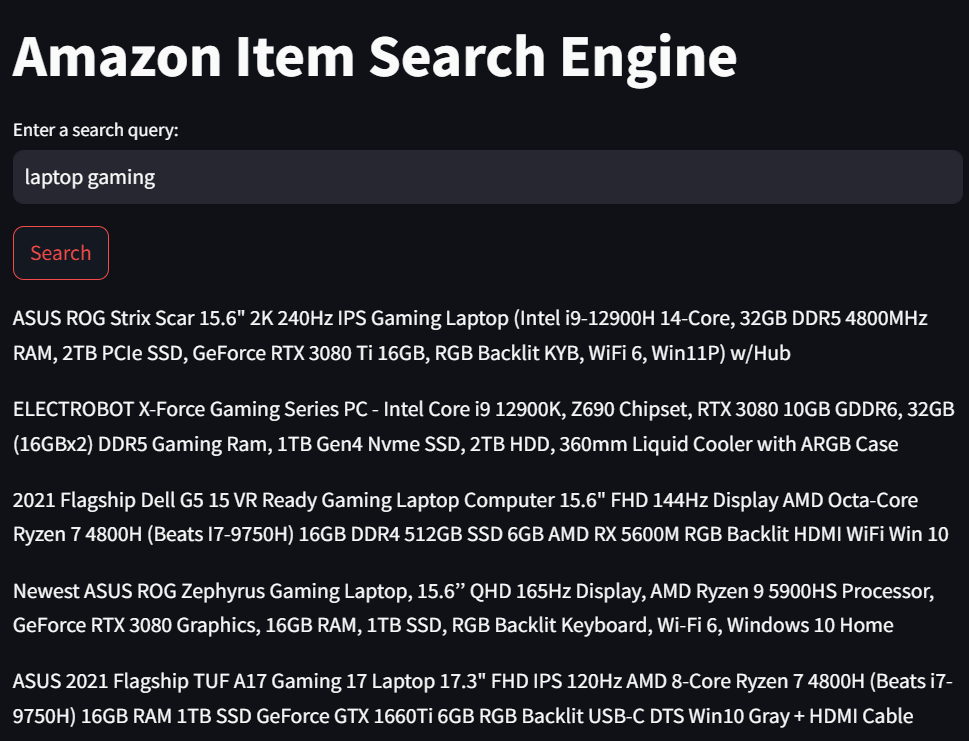
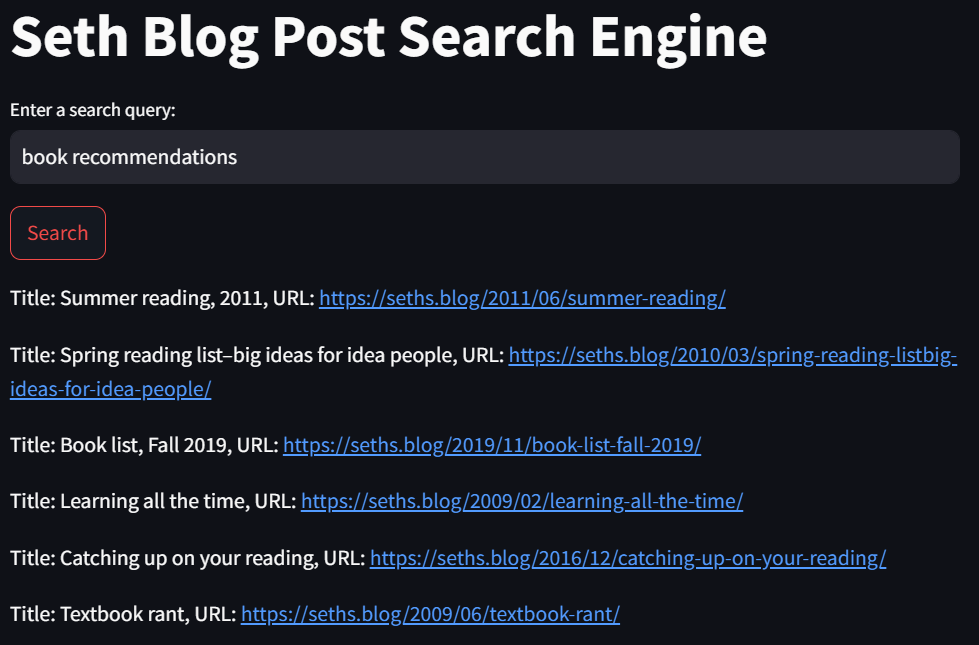

# Search Engine Project

## Overview

This project implements a simple search engine using txtai, Streamlit, and sentence-transformers. It provides search functionality for two datasets:

**Amazon Items:** Searches through product titles from `amazon-data.csv`.

**Seth Blog Posts:** Searches blog post titles and URLs from `seth-data.csv`.

## Project Structure
```
search-engine-project/
│── data/
│   ├── amazon-data.csv
│   ├── seth-data.csv
│── embeddings/
│   ├── embeddings_amazon.tar.gz
│   ├── embeddings_seth.tar.gz
│── images/
│   ├── amazon_search_example.png
│   ├── seth_blog_search_example.png
│── .gitignore.py
│── create_embeddings_amazon_dataset.py
│── create_embeddings_seth_dataset.py
│── main.py
│── README.md
│── requirements.txt
```

### Dataset
- [**Amazon Product Dataset**](https://www.kaggle.com/datasets/piyushjain16/amazon-product-data)

- [**Seth Godin's Blogs Dataset**](https://www.kaggle.com/datasets/glushko/seth-godins-blogs-dataset)

## Features

- Load precomputed embeddings for fast search

- Streamlit web interface for querying data

- Two modes: Amazon item search and Seth blog post search

- Uses txtai and sentence-transformers for embedding-based search

## Installation & Setup

### Install Dependencies

```sh
pip install -r requirements.txt
```
or manually:
```sh
pip install streamlit numpy pandas txtai
```

## Usage

### Create Embeddings:

Run the `create_embeddings.py` script to generate and save embeddings:
```
python create_embeddings.py
```
This will generate embeddings_seth.tar.gz.

### Run the Search Engine:
To start the Streamlit app, run:
```
streamlit run main.py
```

### Access the Application:
Open your web browser and go to `http://localhost:8501` to use the search engines.

## Example Usage

1. Open the Streamlit interface.

2. Enter a query.

3. Click "Search" to see relevant results.

## Screenshots
Example search results from the Streamlit interface:

### Amazon Search Example


### Seth Blog Search Example


### Acknowledgments

- **Inspiration:** YouTube tutorial

- **Libraries Used:** txtai, Streamlit, pandas, numpy, sentence-transformers